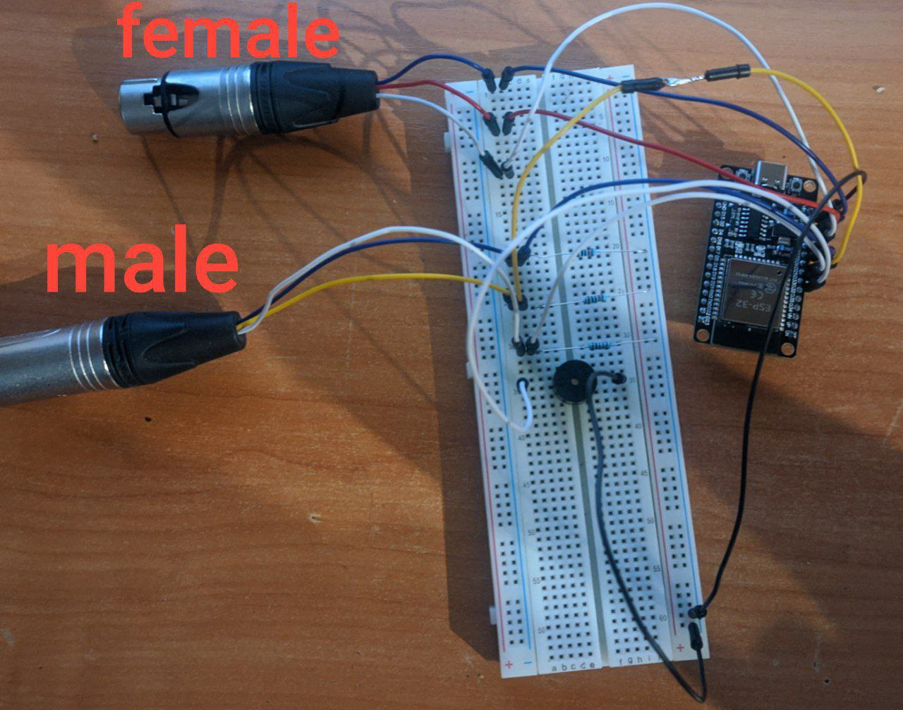
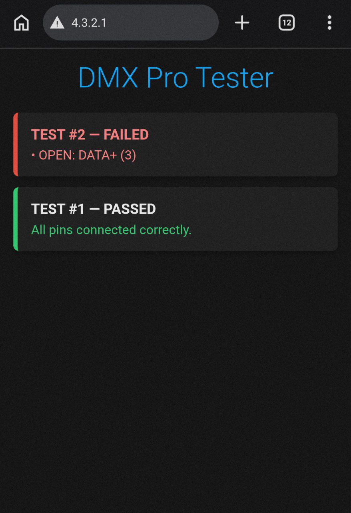

## dmx/xlr cable tester based on ESP32 board with web interface via wi-fi
The tester is designed to check DMX cables for:  
1. Integrity  each of wire connections inside cable.
2. Short circuits.
3. Reversed connections.  
<pre>Connection scheme:  
esp32 pins <----> DMX connectors pins 

[ ESP32 ]                           [ DMX Female ]  
GPIO 13 ---------------------------> Pin 1 (screen/ground)  
GPIO 12 ---------------------------> Pin 2 (data-)  
GPIO 14 ---------------------------> Pin 3 (data+)  

[ DMX Male ]                        [ ESP32 ]  
Pin 1 (screen/ground) -------------> GPIO 27  
Pin 2 (data-) ---------------------> GPIO 26  
Pin 3 (data+) ---------------------> GPIO 25  
</pre>
<pre>
[ Buzzer ]                          [ ESP32 }
Buzzer(+) -------------------------> GPIO 33  
Buzzer(-) -------------------------> GND  
</pre>

### Circuit photo
Using 10kOm resistors is optional (legacy from previous circuit scheme)  

## Build and Upload instruction
1. Assemble the circuit on a breadboard using the information and photo above.
2. Open dmx_tester_web/dmx_tester_web.ino in Arduino IDE.
3. Connect your ESP32 board with PC.
4. Choose your board (in my case it is  DOIT ESP32 DEVKIT V1) in Arduino IDE.
5. Build and Upload.

## How to use
After you build and upload sketch to ESP32 board follow next steps:  
1. Connect the cable you want to be tested to the corresponding connectors.
2. Connect to WI-FI acces point "DMX-Tester-Pro".  
3. In browser open page 4.3.2.1:80.
4. Press "boot" button on ESP32 board (this step initiate test itself).

The page in browser will show you whether the cable test was successful or not. If the test was unsuccessful, you'll also see detailed information about which pin in the cable being caused the problem.  
Repeat steps 1 and 4 to test more cables.  
A sample output is shown in the screenshot:  
<pre>The cable#1 was tested sucessfuly.  
The cable#2 has problem with data+ wire.  </pre>
  
